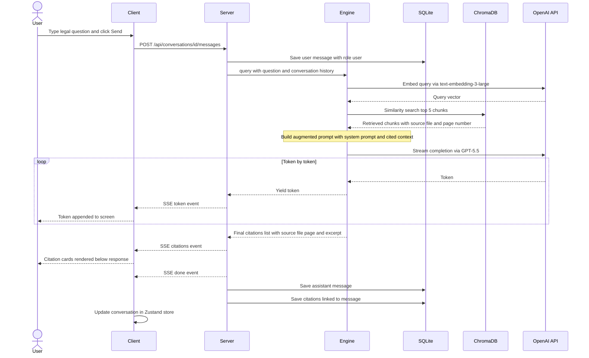

```mermaid
sequenceDiagram
    actor User
    participant C as Client
    participant S as Server
    participant E as Engine
    participant DB as SQLite
    participant VDB as ChromaDB
    participant AI as OpenAI API

    User->>C: Type legal question and click Send
    C->>S: POST /api/conversations/id/messages
    S->>DB: Save user message with role user
    S->>E: query with question and conversation history

    E->>AI: Embed query via text-embedding-3-large
    AI-->>E: Query vector

    E->>VDB: Similarity search top 5 chunks
    VDB-->>E: Retrieved chunks with source file and page number

    Note over E: Build augmented prompt with system prompt and cited context

    E->>AI: Stream completion via GPT-5.5

    loop Token by token
        AI-->>E: Token
        E-->>S: Yield token
        S-->>C: SSE token event
        C-->>User: Token appended to screen
    end

    E-->>S: Final citations list with source file page and excerpt
    S-->>C: SSE citations event
    C-->>User: Citation cards rendered below response

    S-->>C: SSE done event
    S->>DB: Save assistant message
    S->>DB: Save citations linked to message
    C->>C: Update conversation in Zustand store
```
