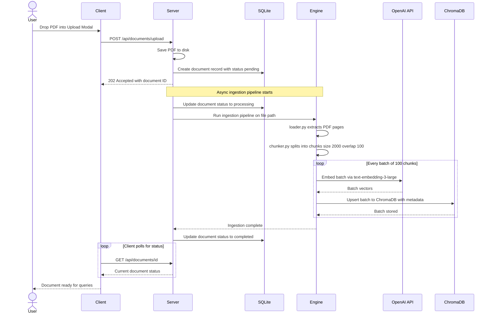

```mermaid
sequenceDiagram
    actor User
    participant C as Client
    participant S as Server
    participant DB as SQLite
    participant E as Engine
    participant AI as OpenAI API
    participant VDB as ChromaDB

    User->>C: Drop PDF into Upload Modal
    C->>S: POST /api/documents/upload
    S->>S: Save PDF to disk
    S->>DB: Create document record with status pending
    S-->>C: 202 Accepted with document ID

    Note over S,E: Async ingestion pipeline starts

    S->>DB: Update document status to processing
    S->>E: Run ingestion pipeline on file path

    E->>E: loader.py extracts PDF pages
    E->>E: chunker.py splits into chunks size 2000 overlap 100

    loop Every batch of 100 chunks
        E->>AI: Embed batch via text-embedding-3-large
        AI-->>E: Batch vectors
        E->>VDB: Upsert batch to ChromaDB with metadata
        VDB-->>E: Batch stored
    end

    E-->>S: Ingestion complete
    S->>DB: Update document status to completed

    loop Client polls for status
        C->>S: GET /api/documents/id
        S-->>C: Current document status
    end

    C-->>User: Document ready for queries
```
