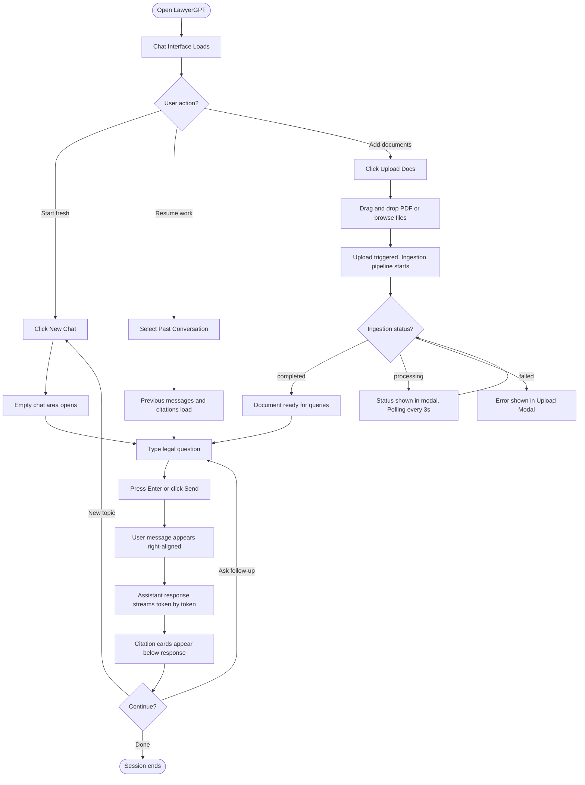

```mermaid
flowchart TD
    Start([Open LawyerGPT]) --> MainView[Chat Interface Loads]
    MainView --> UserAction{User action?}

    UserAction -->|Start fresh| NewChat[Click New Chat]
    UserAction -->|Resume work| SelectConvo[Select Past Conversation]
    UserAction -->|Add documents| UploadDocs[Click Upload Docs]

    NewChat --> EmptyChat[Empty chat area opens]
    SelectConvo --> LoadHistory[Previous messages and citations load]

    EmptyChat --> TypeQ[Type legal question]
    LoadHistory --> TypeQ

    TypeQ --> SendMsg[Press Enter or click Send]
    SendMsg --> UserBubble[User message appears right-aligned]
    UserBubble --> Streaming[Assistant response streams token by token]
    Streaming --> ShowCitations[Citation cards appear below response]
    ShowCitations --> Continue{Continue?}

    Continue -->|Ask follow-up| TypeQ
    Continue -->|New topic| NewChat
    Continue -->|Done| End([Session ends])

    UploadDocs --> DropZone[Drag and drop PDF or browse files]
    DropZone --> Uploading[Upload triggered. Ingestion pipeline starts]
    Uploading --> IngStatus{Ingestion status?}

    IngStatus -->|completed| DocReady[Document ready for queries]
    IngStatus -->|processing| Wait[Status shown in modal. Polling every 3s]
    IngStatus -->|failed| Error[Error shown in Upload Modal]

    Wait --> IngStatus
    DocReady --> TypeQ
```
