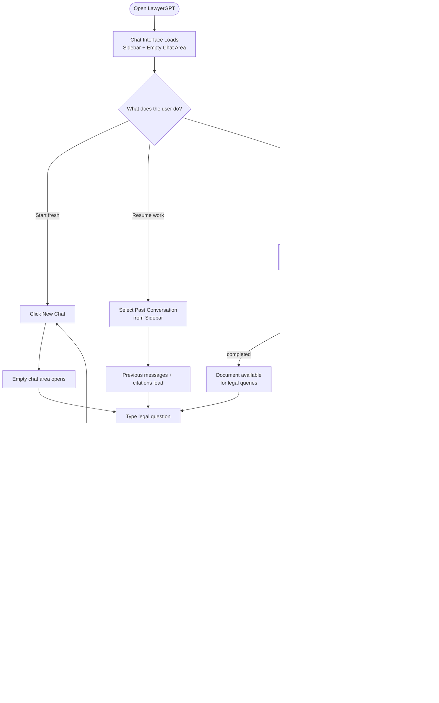
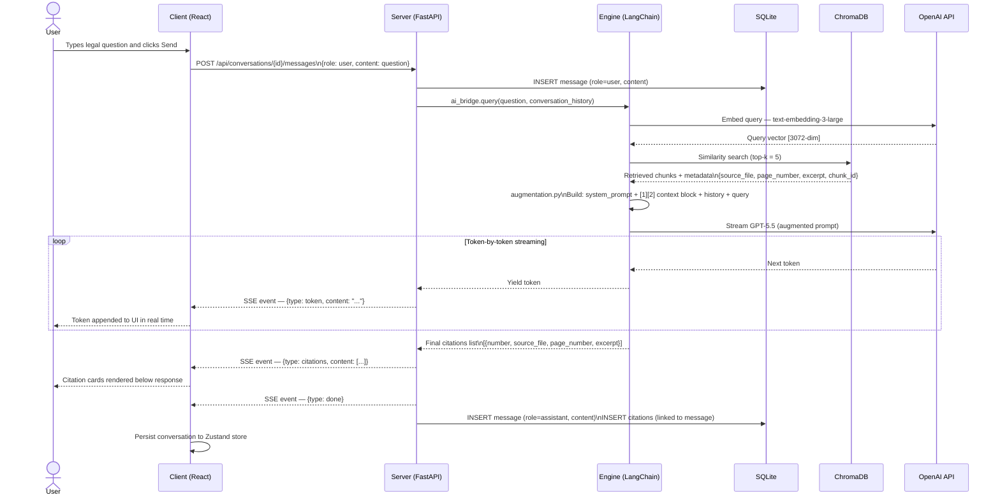
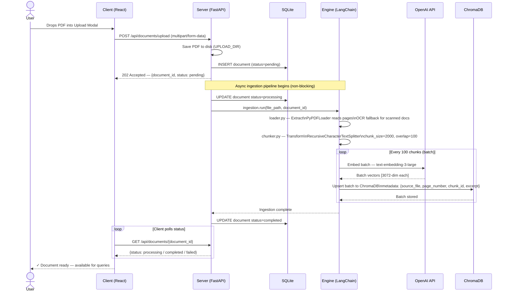

# LawyerGPT — Diagrams

---

## 1. User Flow Diagram

```mermaid
flowchart TD
    Start([Open LawyerGPT]) --> MainView[Chat Interface Loads\nSidebar + Empty Chat Area]

    MainView --> A{What does the user do?}

    A -->|Start fresh| NewChat[Click New Chat]
    A -->|Resume work| SelectConvo[Select Past Conversation\nfrom Sidebar]
    A -->|Add documents| UploadDocs[Click Upload Docs]

    NewChat --> EmptyChat[Empty chat area opens]
    SelectConvo --> LoadHistory[Previous messages + citations load]

    EmptyChat --> TypeQ[Type legal question]
    LoadHistory --> TypeQ

    TypeQ --> Send[Press Enter or click Send]
    Send --> UserBubble[User message appears\nright-aligned]
    UserBubble --> Streaming[Assistant response\nstreams token-by-token]
    Streaming --> Citations[Citation cards appear\nbelow response]
    Citations --> Continue{Continue?}

    Continue -->|Ask follow-up| TypeQ
    Continue -->|New conversation| NewChat
    Continue -->|Done| End([Session ends])

    UploadDocs --> DropZone[Drag and drop PDF\nor browse files]
    DropZone --> Uploading[Upload triggered\nIngestion pipeline starts]
    Uploading --> IngestionStatus{Ingestion status?}
    IngestionStatus -->|completed| DocReady[Document available\nfor legal queries]
    IngestionStatus -->|processing| Wait[Status shown in modal\npolling every 3s]
    IngestionStatus -->|failed| ErrorShown[Error displayed\nin Upload Modal]
    Wait --> IngestionStatus
    DocReady --> TypeQ
```

---

## 2. Sequence Diagram — Chat Flow

```mermaid
sequenceDiagram
    actor User
    participant C as Client (React)
    participant S as Server (FastAPI)
    participant E as Engine (LangChain)
    participant DB as SQLite
    participant VDB as ChromaDB
    participant AI as OpenAI API

    User->>C: Types legal question and clicks Send
    C->>S: POST /api/conversations/{id}/messages\n{role: user, content: question}
    S->>DB: INSERT message (role=user, content)
    S->>E: ai_bridge.query(question, conversation_history)

    E->>AI: Embed query — text-embedding-3-large
    AI-->>E: Query vector [3072-dim]

    E->>VDB: Similarity search (top-k = 5)
    VDB-->>E: Retrieved chunks + metadata\n{source_file, page_number, excerpt, chunk_id}

    E->>E: augmentation.py\nBuild: system_prompt + [1][2] context block + history + query

    E->>AI: Stream GPT-5.5 (augmented prompt)

    loop Token-by-token streaming
        AI-->>E: Next token
        E-->>S: Yield token
        S-->>C: SSE event — {type: token, content: "..."}
        C-->>User: Token appended to UI in real time
    end

    E-->>S: Final citations list\n[{number, source_file, page_number, excerpt}]
    S-->>C: SSE event — {type: citations, content: [...]}
    C-->>User: Citation cards rendered below response

    S-->>C: SSE event — {type: done}
    S->>DB: INSERT message (role=assistant, content)\nINSERT citations (linked to message)
    C->>C: Persist conversation to Zustand store
```

---

## 3. Sequence Diagram — Document Upload & Ingestion

```mermaid
sequenceDiagram
    actor User
    participant C as Client (React)
    participant S as Server (FastAPI)
    participant DB as SQLite
    participant E as Engine (LangChain)
    participant AI as OpenAI API
    participant VDB as ChromaDB

    User->>C: Drops PDF into Upload Modal
    C->>S: POST /api/documents/upload (multipart/form-data)
    S->>S: Save PDF to disk (UPLOAD_DIR)
    S->>DB: INSERT document (status=pending)
    S-->>C: 202 Accepted — {document_id, status: pending}

    Note over S,E: Async ingestion pipeline begins (non-blocking)

    S->>DB: UPDATE document status=processing
    S->>E: ingestion.run(file_path, document_id)

    E->>E: loader.py — Extract\nPyPDFLoader reads pages\nOCR fallback for scanned docs
    E->>E: chunker.py — Transform\nRecursiveCharacterTextSplitter\nchunk_size=2000, overlap=100

    loop Every 100 chunks (batch)
        E->>AI: Embed batch — text-embedding-3-large
        AI-->>E: Batch vectors [3072-dim each]
        E->>VDB: Upsert batch to ChromaDB\nmetadata: {source_file, page_number, chunk_id, excerpt}
        VDB-->>E: Batch stored
    end

    E-->>S: Ingestion complete
    S->>DB: UPDATE document status=completed

    loop Client polls status
        C->>S: GET /api/documents/{document_id}
        S-->>C: {status: processing / completed / failed}
    end

    C-->>User: ✓ Document ready — available for queries
```
